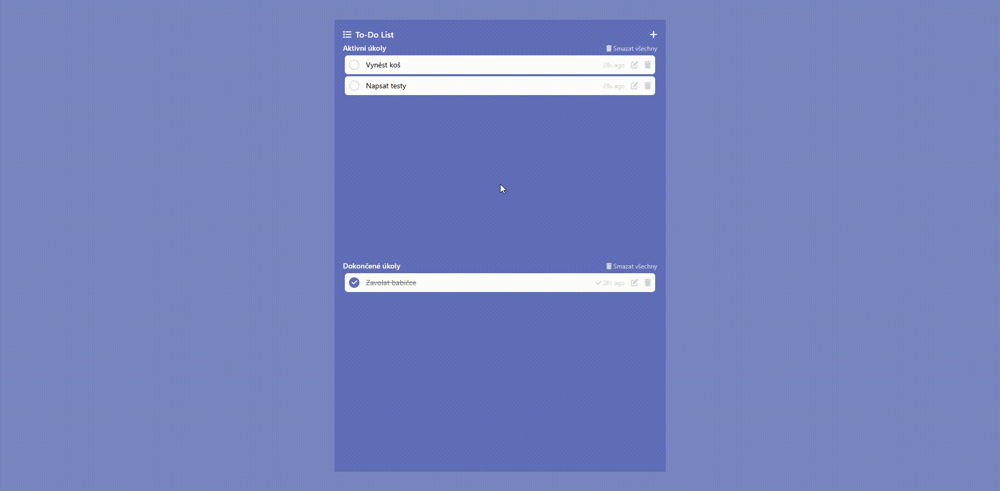

# Todo App

Jednoduchá Laravel aplikace pro správu úkolů (todo list) s použitím Livewire, PostgreSQL, Dockeru a Tailwind CSS.

---

## 🖼️ Ukázka aplikace


---

## 📚 Použité technologie

* [Laravel 12](https://laravel.com/)
* [Livewire 3](https://livewire.laravel.com/)
* [Tailwind CSS](https://tailwindcss.com/)
* [PostgreSQL 17.5](https://www.postgresql.org/)
* [Docker](https://www.docker.com/)
* [Vite](https://vitejs.dev/)
* PHP 8.4 (preview build)

---

## 🏗️ Architektura projektu
Aplikace je navržena s důrazem na čistý a udržitelný kód. Veškerá business logika je oddělena do service vrstev, data jsou validována pomocí FormRequestů a předávána pomocí DTO. Díky tomu je aplikace snadno rozšiřitelná a jednotlivé části lze dobře testovat i samostatně.

* Projekt využívá architekturu s oddělením obchodní logiky (service layer) a validace (FormRequest).
* Data jsou mezi vrstvami předávána pomocí DTO (Data Transfer Object), což umožňuje lepší škálovatelnost a jednodušší testování jednotlivých částí aplikace.
* Cílem bylo ukázat best practices, které jsou využitelné i ve větších projektech a týmech.

---

## ⚡ Funkce

* Vytváření, editace a mazání úkolů
* Označování jako "hotovo" pomocí Livewire bez reloadu
* Oddělené seznamy aktivních a dokončených úkolů
* Možnost hromadného smazání všech aktivních/dokončených úkolů
* Přehled zbývajícího/dokončeného času (např. "1m ago") s automatickou aktualizací
* Stylováno pomocí Tailwind CSS + Font Awesome ikonky
* Pokrytí klíčových funkcí pomocí PHPUnit testů (```npm run test```)

---

## 🚀 Instalace

> Předpoklad: nainstalovaný [Docker](https://www.docker.com/) a [Node.js + npm](https://nodejs.org/)

### 1. Naklonuj repozitář

```bash
git clone ...
cd todo-app
```

### 2. Spusť Docker kontejnery

```bash
npm run docker-up
```

### 3. Spusť Docker kontejnery

```bash
npm run composer-install
```

### 4. Zkopíruj a nastav .env soubor

```bash
cp .env.example .env
npm run keygen
```

### 5. Inicializuj databázi a naplň ukázková data

```bash
npm run init
```

Nebo pro tvrdý reset včetně vygenerování nového APP\_KEY:

```bash
npm run init:fresh
```

### 6. Spusť vývojový server

```bash
npm run dev
```

---

## 🔧 Užitečné skripty

| Příkaz                     | Popis                                      |
|----------------------------| ------------------------------------------ |
| `npm run artisan`          | Spouštění artisan příkazů přes Docker      |
| `npm run keygen`           | Vygeneruje `APP_KEY`                       |
| `npm run migrate`          | Spustí migrace                             |
| `npm run seed`             | Naplní databázi ukázkovými daty            |
| `npm run init`             | Vygeneruje klíč, migrace, seed             |
| `npm run init:clean`       | Resetuje DB a provede seed (bez keygen)    |
| `npm run init:fresh`       | Tvrdý reset: keygen + fresh migrate + seed |
| `npm run cache-clear`      | Vyčistí cache, routy, view                 |
| `npm run route-list`       | Vypíše všechny dostupné routy              |
| `npm run test`             | Spustí PHPUnit testy                       |
| `npm run composer-install` | Nainstaluje PHP závislosti (Composer)      |

---

## 📂 Struktura projektu (základ)

```
todo-app/
├── src/                  # Laravel aplikace
│   ├── app/
│   ├── resources/
│   ├── routes/
│   ├── tests/
│   └── ...
├── docker-compose.yml
├── Dockerfile
├── package.json
├── .env.example
└── README.md
```

---

## Kontakt / autor

**Ondřej Nevřela**

[🌐 ondrejnevrela.cz](https://ondrejnevrela.cz/)  
[💼 LinkedIn](https://www.linkedin.com/in/ondrej-nevrela/)

---

## 🚨 Poznámky

* Aplikace nepoužívá autentizaci (je zaměřena pouze na funkčnost a UX)
* Všechna data se ukládají do PostgreSQL kontejneru
* Livewire se stará o okamžitou aktualizaci dokončených úkolů bez reloadu
* Mazání úkolů probíhá klasickým formulářem a vyžaduje reload stránky – není řešeno přes Livewire. Bylo to rozhodnuto vědomě pro jednoduchost a čistotu komponent.
* CSS a JavaScript jsou již zbuildované a přiložené ve verzi – není třeba spouštět npm run dev pro testování